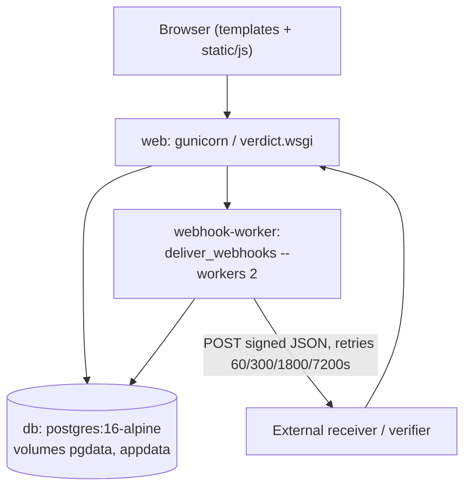
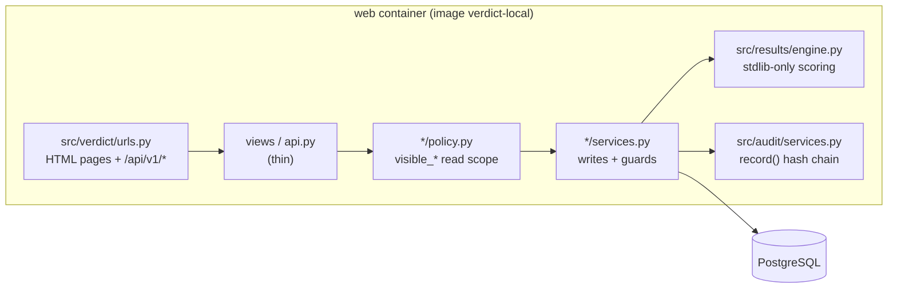
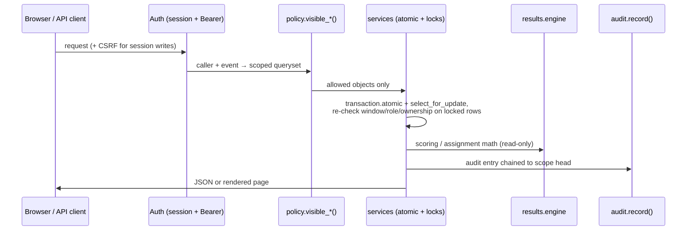

# Architecture

VERDICT is a modular Django monolith: one deployable (`Dockerfile` →
gunicorn), one database (PostgreSQL 16, `docker-compose.yml` service `db`),
one background worker (`webhook-worker`, `python manage.py deliver_webhooks
--workers 2`). The `src/` tree holds one Django app per domain; `manage.py`
adds `src/` to `sys.path` and settings live in `src/verdict/settings.py`.

## Request lifecycle

Every write travels the same path; reads are scoped before they are rendered.

Concretely: auth is `BearerTokenAuthentication + SessionAuthentication`
(`src/verdict/settings.py`); time is `core.clock.now()` and windows are
half-open `[open, close)`; errors use the envelope
`{"error": {"code", "message", "fields"}}` (`src/core/errors.py`) with 400 /
401 / 403 / 404 / 409 / 429. HTML views only read; every mutation goes through
`/api/v1/...` via `src/static/js/api-forms.js` (`data-api-method`,
`data-api-url`, `data-success`). Templates never expose integer PKs (routes
and payloads use `public_id`/`slug`) or emails publicly. Lock order is fixed
per domain (event → team → invite, `src/teams/services.py`) to avoid
deadlocks; the deterministic race tests in `tests/test_adversarial_t1.py`
document why (see `docs/ADVERSARIAL-T1-RACES.md`).

## Module map

| Area | Code | Owns |
|---|---|---|
| Platform | `src/verdict/settings.py`, `src/verdict/urls.py`, `src/core/bootstrap.py`, `src/core/clock.py`, `src/core/errors.py`, `src/core/middleware.py` | Postgres-only DB config, routing, idempotent seed, server time, error envelope, CSP (`script-src 'self'`) |
| Identity | `src/accounts/services.py`, `src/accounts/policy.py`, `src/accounts/tokens.py` | Register/login/reset, demo-mode gate, bearer tokens |
| Events | `src/events/services.py`, `src/events/policy.py` | Event CRUD, windows, tracks, prizes, questions, organizer roles |
| Teams/projects | `src/teams/services.py`, `src/projects/services.py` | Invites with use-count races closed, revisions, stale-edit tokens, media |
| Judging | `src/judging/assign.py`, `src/judging/forecast.py`, `src/judging/services.py`, `src/judging/policy.py` | Assignment proposals, pace/rebalance math, rubric locking, reviews, pairwise |
| Scoring | `src/results/engine.py`, `src/results/closure.py` | Fit/rank/verify math (stdlib-only, no Django); bounded completion-witness search |
| Publication | `src/results/services.py`, `src/results/prizes.py`, `src/results/models.py` | Preview, publish, `verify_publication`, feedback release, prize allocation |
| Community | `src/community/services.py`, `src/community/policy.py` | Voting configs, ballots, comments/moderation, hidden tallies |
| Interop | `src/interop/exports.py`, `src/interop/importer.py`, `src/interop/webhooks.py`, `src/interop/certificates.py`, `src/interop/signing.py` | CSV/JSON export, fixture import, durable webhook outbox, HMAC links, Ed25519 records |
| Integrity | `src/audit/services.py`, `src/audit/models.py`, `src/core/management/commands/runportal.py` | Append-only hash-chained audit, boot/migrate/seed/serve entrypoint |
| UI | `src/templates/`, `src/static/js/`, `src/static/css/`, `src/static/vendor/`, `src/static/fonts/` | Server-rendered pages per role; vendored Bootstrap/fonts, no CDN |
| Checks | `run.py`, `scripts/gate.py`, `scripts/verify_tiers.py`, `scripts/attack.py`, `scripts/normalization_proof.py`, `scripts/verify_record.py` | Acceptance, full gate, tier evidence, attack probes, proof regeneration, record verification |

Key pages: gallery `src/templates/projects/gallery.html`, submission editor
`src/templates/projects/editor.html`, judge queue/review/pairwise
`src/templates/judge/queue.html`, `src/templates/judge/review.html`,
`src/templates/judge/pairwise.html`, Command Center
`src/templates/manage/command_center.html`, Decision Room
`src/templates/manage/decision_room.html` (+ `decision_record.html`),
results/progress/assignments `src/templates/manage/results.html`,
`src/templates/manage/progress.html`, `src/templates/manage/assignments.html`,
public results `src/templates/events/results_public.html`, ballot
`src/templates/community/ballot.html`, record verify
`src/templates/interop/verify.html`. Key scripts:
`src/static/js/api-forms.js` (sole write path), `judge-console.js`,
`pairwise.js`, `command-center.js`, `results.js`, `submission-editor.js`,
`voting.js`.

## Decisions worth stealing, with reasons

1. **Policy/service split, enforced by tests.** Reads go through
   `policy.visible_*()`; writes go through `services.py` with locks and
   re-checks. Reason: templates hiding a button is not a control; the attack
   probes (`scripts/attack.py`, 28/28 + 14/14 per `attack-report.txt`) test
   bodies, not buttons.
2. **Server time, half-open windows, re-check after lock.** `core.clock.now()`
   is the only clock; close-boundary tests freeze it and race it
   (`tests/test_deadlines.py`, `tests/test_adversarial_t1.py`). Reason: five
   reproduced close-window failures (see `docs/ADVERSARIAL-T1-RACES.md`) all
   came from checking the clock before locking the row.
3. **Pure scoring kernel.** `src/results/engine.py` imports only the standard
   library, so `scripts/normalization_proof.py` and `tests/test_engine.py`
   exercise the exact production math without a database. Reason: the proof in
   `docs/NORMALIZATION-PROOF.md` is byte-regenerable and independent of deploy
   state.
4. **Immutable publications + genuine recomputation.** Publish stores inputs,
   rows, awards and digests (`src/results/models.py`); verify re-runs the
   engine and compares row sets, award sets, stored-input hash and live digest
   (`src/results/services.py`, `verify_publication`). Reason: hash comparison
   alone cannot catch a privileged rewrite; the T2 hardening
   (`docs/ADVERSARIAL-T2-PRIVACY.md`,
   `docs/ADVERSARIAL-INTEGRATION-20260927.md`) found verifier holes precisely
   there.
5. **Private notes structurally excluded.** `project_feedback` returns
   `comments: []` always; organizer reads go through `exports/reviews.csv` and
   manage pages. Reason: the collected `Review.comment` field promised privacy
   in `src/templates/judge/review.html` while feeding team output — fixed and
   locked by `tests/test_adversarial_t2.py`.
6. **Durable webhook outbox, at-least-once.** Mutations enqueue; the worker
   leases, retries and supports replay with receiver-visible delivery IDs
   (`src/interop/webhooks.py`, `deliver_webhooks`). Reason: exactly-once is
   not promised; idempotency guidance plus `scripts/webhook_receiver.py` for
   local testing beats an untestable guarantee.
7. **One app container, Python entrypoint, Postgres everywhere.**
   `Dockerfile` (non-root user, baked static files) + `runportal.py` (wait,
   migrate, seed, exec gunicorn). Reason: no SQLite fallback anywhere
   (`src/verdict/settings.py` rejects it), so dev, CI and tests share one
   database semantics; `scripts/gate.py` runs check → migrations →
   Django tests → pure engine tests.
