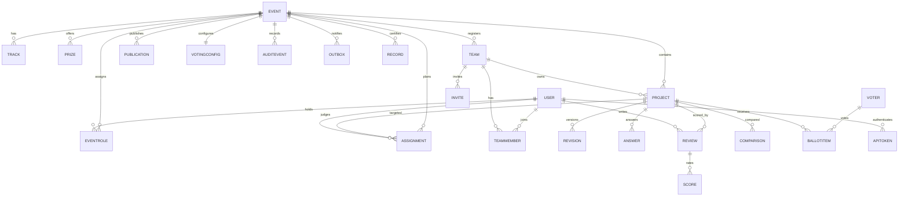

# Data model

Conventions: every row carries a random `public_id` (URLs and API payloads;
integer PKs never leave the server) and event-scoped rows carry the event.
One user holds at most one role per event. All constraints below are
`Meta.constraints` in each app's `models.py` under `src/`; check them with
`.venv\Scripts\python.exe scripts/gate.py` (its migrations step fails on
model/migration drift).

## Tables and the invariants each constraint protects

**Identity — `src/accounts/models.py`.** `User` (`accounts_user`): no DB
constraint; uniqueness of email and demo/production gating live in
`src/accounts/services.py` + `src/core/bootstrap.py`. `ApiToken`:
`key_hash` unique — a token hash identifies exactly one token, so lookup and
revocation cannot collide. `PasswordResetToken`: `token_hash` unique — a reset
link resolves to one request.

**Events — `src/events/models.py`.** `Event`:
`event_submissions_window_ordered` (submissions open before close),
`event_judging_after_submissions` and `event_judging_window_ordered`
(judging runs inside a sane window), `event_max_team_size_range`,
`event_reviews_per_project_positive`, `event_pairwise_min_positive` — the
planner and guards can assume positive, ordered configuration.
`Track`: `track_unique_name_per_event`, `track_unique_public_id_per_event` —
tracks are addressable and unambiguous within an event. `Prize`:
`prize_unique_public_id_per_event`, `prize_places_positive`,
`prize_scope_matches_track` — every prize has a positive size and a track
scope consistent with its track, which `allocate` in `src/results/prizes.py` relies on.
`CustomQuestion`: `question_unique_public_id_per_event`. `EventRole`:
`role_unique_per_event_user` — one role per user per event (the permission
matrix has no double-role case); `role_unique_public_id_per_event`.

**Teams — `src/teams/models.py`.** `Team`: `team_unique_public_id_per_event`.
`TeamMember`: `member_unique_team_per_event` — a user sits on at most one team
per event (joining a second is refused, `tests/test_adversarial_t1.py`).
`TeamInvite`: `token` unique — an invite link resolves to one invite; use
counts are enforced under row locks in `src/teams/services.py`.

**Projects — `src/projects/models.py`.** `Project`:
`project_unique_public_id_per_event`; partial
`project_one_active_per_team` over `status in (draft, submitted)` — a team has
at most one live project, so duplicate handling (latest submission
supersedes, e.g. fixture `prj_41` over `prj_07`) has a well-defined target.
`ProjectRevision`: `revision_unique_per_project` — revision numbers order
edits and stale-edit tokens. `Answer`: `answer_unique_per_project` — one
answer per question per project.

**Judging — `src/judging/models.py`.** `Criterion`:
`criterion_unique_key_per_rubric` (the rubric is a fixed key set),
`criterion_weight_positive`, `criterion_max_above_min` — `review_score` in
`src/results/engine.py` never divides by zero or a negative weight.
`Conflict`: `conflict_unique_judge_team` — one declaration per judge/team.
`Assignment`: `assignment_unique_judge_project` (a judge is assigned a project
once) and `assignment_unique_public_id_per_event`. `Review`:
`review_unique_public_id_per_event`. `CriterionScore`:
`score_unique_per_review` — one value per criterion per review.
`Comparison`: `comparison_distinct_projects` (no self-pairs),
`comparison_canonical_pair` (`left < right`, so a pair has one row),
`comparison_winner_in_pair` (winner is one of the two),
`comparison_unique_active_pair` partial on `retracted_at IS NULL` — a judge
holds at most one active verdict per pair; retraction keeps history
(`src/templates/judge/pairwise.html` offers 30 s undo).

**Results — `src/results/models.py`.** `ResultPublication`:
`publication_unique_public_id_per_event`. Immutability is a service rule, not
a constraint: `publish` in `src/results/services.py` snapshots params,
inputs, rows, awards and digests; corrections require a new publication.

**Community — `src/community/models.py`.** `VotingConfig` (one per event):
`community_voting_credits_positive`, `community_max_votes_positive`,
`community_single_vote_limit_is_one` — single-style ballots cannot exceed one
vote per project; `link_token` unique. `Voter`:
`community_voter_event_user_uniq`, `community_voter_event_email_uniq`
(keyed hash, not the address), `community_voter_event_device_uniq` — one
ballot per identity per event per mode; duplicates return 409.
`BallotItem`: `community_ballot_project_uniq`,
`community_ballot_votes_nonnegative` — quadratic budgets in
`src/community/services.py` sum squares against non-negative votes.

**Audit — `src/audit/models.py`.** `AuditChainHead`: `scope_key` unique — one
hash chain per scope. `AuditEvent`: `audit_chain_sequence_uniq`
(sequence numbers cannot fork), `audit_sequence_positive`; the queryset
blocks `update`/`delete`/`bulk_create` and `save` requires append, so history
is write-once (`record()` in `src/audit/services.py`).

**Outbox — `src/core/models.py`.** `OutboxMessage`: `public_id` unique —
organizer/admin mail queued when SMTP is unconfigured or `DEMO_MODE=1`,
viewed at `src/templates/core/outbox.html`.

**Interop — `src/interop/models.py`.** `WebhookEndpoint`:
`interop_wh_unique_public_id`; `WebhookDelivery`:
`interop_wd_unique_public_id` with lease/retry state for at-least-once
delivery (`src/interop/webhooks.py`). `JudgeParticipationRecord`:
`interop_record_id_per_event`, `interop_record_one_per_judge_event` — one
signed record per judge per event (Ed25519 via `src/interop/signing.py`).

## Import path

`POST /api/v1/imports` → `import_fixture()` in `src/interop/importer.py` runs in
one transaction: fixed rubric, tracks, judges, teams, projects, scores from
`fixtures.json`-shaped data (41 projects, 126 scores, 30 judges in the
shipped file). Bounded file size, schema validation, referential checks and
all-or-nothing rollback; duplicate IDs and path traversal are refused
(`tests/test_import.py` covers the contract).

## Export path

`GET /api/v1/events/<slug>/exports/<kind>.csv` and `exports/event.json`
(`src/interop/exports.py`, kinds: participants, teams, projects, judges,
assignments, reviews, progress, results, audit, pairwise), plus
`certificates.csv`, `exports/votes.csv` (community) and
`pairwise.csv` (original + retracted judgments). Every queryset is
`policy.visible_*()`-scoped; tallies and voter identities stay hidden until
close. Regenerate the proof tables from the same inputs with
`.venv\Scripts\python.exe scripts/normalization_proof.py`.

## What is never exported

Emails in any public output (only keyed hashes server-side); `Review.comment`
(team feedback carries `comments: []` always — `tests/test_adversarial_t2.py`);
password hashes, API token plaintext (only the prefix is stored alongside the
hash), `SECRET_KEY`, Ed25519 private keys (`DATA_DIR/keys`), webhook secrets,
invite/reset token plaintext, and audit entry hashes outside the scoped
organizer/admin views.
